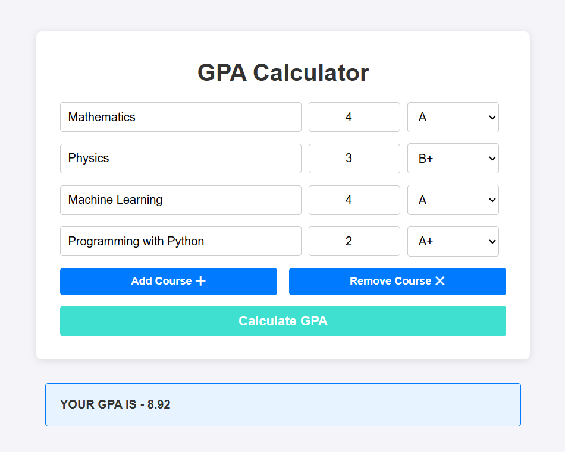

# GPA Calculator

This project is a simple web-based **GPA Calculator** that allows users to input their course information, credits, and grades to calculate their GPA. It uses HTML, CSS, and JavaScript for the frontend and logic. Additionally, users can **_directly paste their results_** into the website, and the tool will scrape the report to calculate the GPA automatically.

## Features

- **Dynamic Input Fields**: Add multiple courses with ease.
- **Copy-Paste Functionality**: Paste your grade report directly into the application to auto-populate course data and calculate the GPA.
- **Dropdown Menus**: Select grades from dropdowns to minimize manual input errors.
- **Real-time GPA Calculation**: Results are displayed as soon as inputs are submitted.
- **Error Handling**: Handles invalid or missing inputs gracefully.

## How to Use

1. **Open the Application**: Load the HTML file in any modern web browser.
2. **Add Courses** (if not using copy-paste):
   - Click the "Add Course" button to add fields for a new course.
   - Enter the course details:
     - **Course Name**: Input the course name.
     - **Credits**: Enter the course credits.
     - **Grade**: Select the grade received for the course from the dropdown.
3. **Paste Your Report** (Alternative): Copy your grade report and paste it into the designated input area. The application will automatically scrape the information and populate the necessary fields.
4. **Calculate GPA**: Click the "Calculate GPA" button to view your GPA. The result will be displayed at the bottom of the form.

## Grade-to-Point Mapping

The following grade-to-point mapping is used:

| Grade | Points |
| ----- | ------ |
| A+    | 10     |
| A     | 9      |
| B+    | 8      |
| B     | 7      |
| C+    | 6      |
| C     | 5      |
| D     | 4      |
| E     | 3      |
| F     | 0      |

## Customization

You can modify the following aspects to suit your needs:

- **Grade Mapping**: Update the `gradeMap` object in the script to adjust grade-to-point conversions.
- **Styling**: Enhance the design by adding a separate CSS file or modifying the existing inline styles.
- **Validation Rules**: Extend validation logic to handle specific use cases, such as decimal credits or additional grade systems.

## Future Enhancements

- Save course data locally using browser storage.
- Allow importing and exporting course lists as CSV files.
- Add support for custom grading systems.
- Improve copy-paste parsing for broader report formats.

## License

This project is open-source and free to use under the MIT License. Built by [Kamalveer Singh](https://x.com/kamal_stark_).

You can contact me via my [Twitter (now X)](https://x.com/kamal_stark_) or [LinkedIn](https://www.linkedin.com/in/kamalveer-singh-221719250/) regarding any error or bug you are facing while using the calculator.
